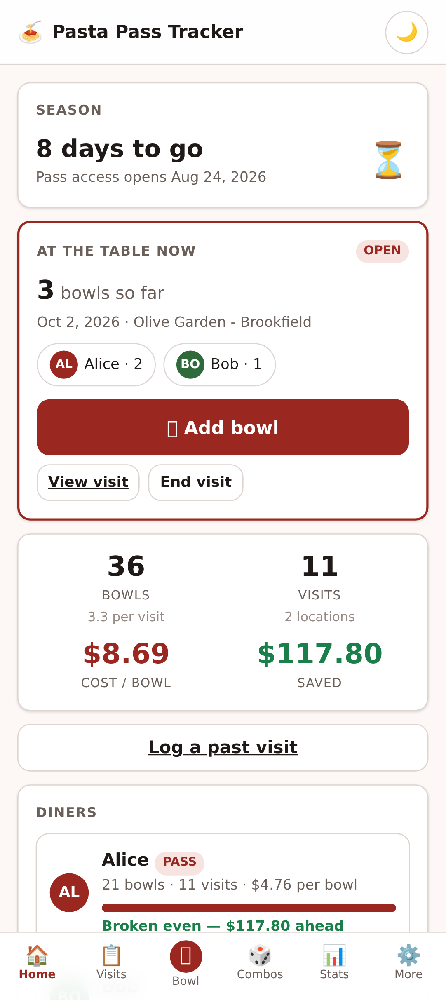
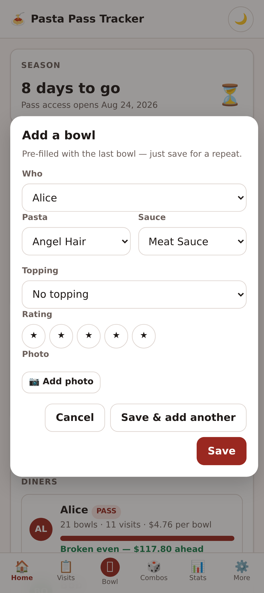
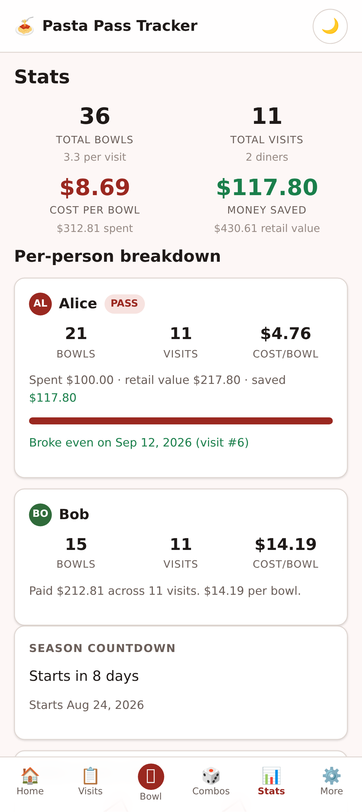
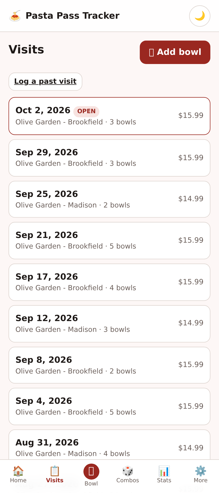
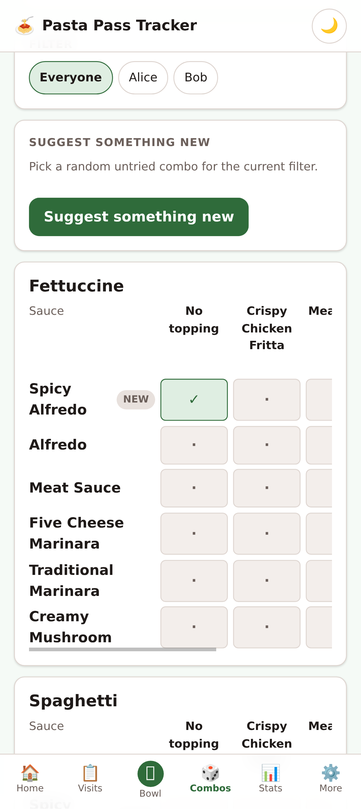
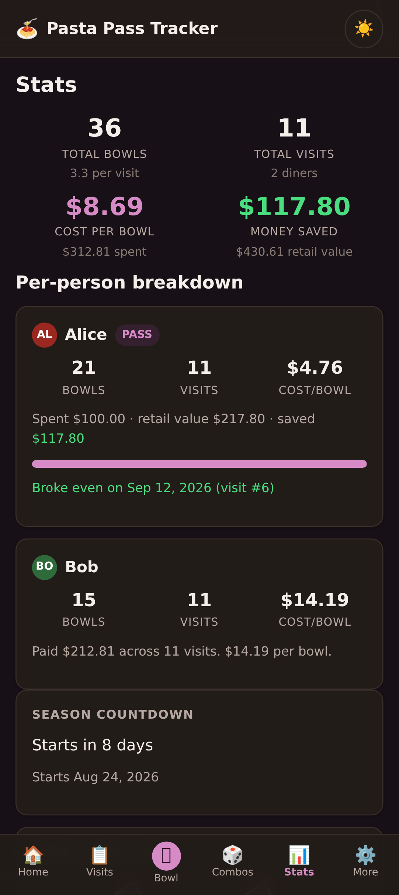

# 🍝 Pasta Pass Tracker

A tiny offline-first PWA for tracking Olive Garden visits and Never-Ending Pasta Pass usage
during the 2026 season.

Track every **bowl** — not just every visit — so you can answer the only question that really
matters: *what is each bowl actually costing me?*

## Screenshots

| At the table | One-tap refills | Stats |
|---|---|---|
|  |  |  |

| Visits | Combo explorer | Dark mode |
|---|---|---|
|  |  |  |


## Features

- **Open and ended visits.** Start a visit when you sit down and it stays *open* while you are at
  the table. A big **＋ Add bowl** button is then one tap away on the dashboard, the visit page,
  and the tab bar. End the visit when you leave — or reopen it if the waiter comes back.
- **One-tap refills.** The add-bowl sheet pre-fills with your last bowl, so a repeat is a single
  tap, and "Save & add another" keeps the sheet open for a round.
- **Log visits and bowls.** A visit holds many bowls; each bowl belongs to a person and records
  a pasta, sauce, and topping.
- **Multiple diners.** Each person independently either holds a pass (prepaid, unlimited) or
  pays per meal, so mixed groups work correctly.
- **Real cost maths.** Money saved, cost per bowl, cost per visit, and break-even tracking —
  computed per person.
- **Per-visit pricing.** Prices vary by location, so the price is captured on each visit and
  frozen there. Correcting a location default later never rewrites your history.
- **120-combo explorer.** A grid of every pasta × sauce × topping combination, tracking which
  you have tried, with a "suggest something new" button.
- **Photos everywhere.** Optional photos on visits, bowls, diners, and menu items. On a phone the
  photo button offers both the camera and your library.
- **Season countdown.** Days remaining, pace, and projected final cost per bowl.
- **Editable menu.** The official 2026 lineup is seeded but fully editable, because Olive Garden
  had not published the complete list before launch.
- **Themes.** Six palettes, each with light and dark variants, plus a custom colour picker.
  Dark mode follows your system setting by default and updates live.
- **Installable.** An **Install app** button in Settings, plus the commit and build date of the
  running deployment. If your browser has not offered a prompt, Settings explains how to install
  from the Android browser menu instead.
- **Fully offline.** Works with no signal, and stores everything on your device.

## Running it

There is **no build step and no runtime dependencies**. It is plain HTML, CSS, and ES modules.

Serve the folder over http (ES modules and service workers do not work from `file://`):

```bash
npm run serve          # http://localhost:8000
```

Or use anything else that serves static files:

```bash
python -m http.server 8000
```

`package.json` exists only for the development and test workflow — it declares **zero
dependencies**, and nothing in it ships to the browser.

## Testing

```bash
npm test               # unit + functional
npm run test:unit      # pure logic only, no browser, runs in milliseconds
npm run test:functional
```

| Layer | What it covers |
|---|---|
| `tests/unit/` | Pure logic: the cost/savings engine, date handling, formatting, combo keys, backup validation. Imports the real modules — no mocks. |
| `tests/functional/` | Real browser, real IndexedDB, real clicks: every route, the full logging flow, photo uploads, backup round-trips, theming, and offline behaviour. |

Functional tests drive **headless Chrome over the DevTools Protocol** directly. Node 22 ships a
global `WebSocket`, so this needs no Playwright or Puppeteer — the whole harness is about 300
lines in `tests/helpers/`. Any test fails automatically if the page logs a console error.

Set `PPT_CHROME` if your Chrome or Edge binary is somewhere unusual.

## Contributing

See **[AGENTS.md](AGENTS.md)** for the instructions AI agents follow when changing this repo —
architecture, domain invariants, code conventions, and the definition of done. It is worth
reading before you make changes yourself. The short version:

> Every change updates the tests. Every bug fix adds a regression test. Every behaviour change
> updates this README, including the screenshots.

Screenshots are generated, never hand-cropped:

```bash
node docs/make-screenshots.mjs
```

That seeds a realistic mid-season dataset and captures each screen at Pixel 10 dimensions
(412 × 924 CSS px at a 2.625 device pixel ratio, so 20:9). Re-run it whenever the UI changes.


## Deploying to GitHub Pages

A GitHub Actions workflow (`.github/workflows/deploy.yml`) publishes the app on every push to
`main`/`master`:

1. **Test** — runs the full unit and functional suite on `ubuntu-latest`, driving the Chrome that
   ships with the runner. A failing commit never reaches the site.
2. **Deploy** — records the commit hash and build date into `commit_hash.txt` and
   `build_date.txt`, then publishes the repository root to Pages.

To enable it, set **Settings → Pages → Source** to **GitHub Actions**. Then open
`https://<user>.github.io/<repo>/` and use the **Install app** button in Settings.

Settings shows the running deployment's short commit hash (linked to the commit) and its build
date, so you can tell exactly which version a device is on. Those two files are generated at
deploy time and are gitignored; running locally simply reports a development build.

**It installs correctly from any of the three GitHub Pages layouts:**

| Layout | Example URL | Works |
|---|---|---|
| Project site (subpath) | `https://you.github.io/pastapasstracker/` | ✅ |
| User site (root) | `https://you.github.io/` | ✅ |
| Custom domain / subdomain | `https://pasta.example.com/` | ✅ |

The subpath case is the fussy one, and it is covered by
`tests/functional/subpath.test.mjs`, which serves the app under a fake `/<repo>/` prefix and
asserts that it boots, that `start_url`/`scope`/`id` resolve inside the subpath, that the service
worker is scoped to the subpath rather than the whole origin, that the shell caches, and that it
still works offline. A companion test fails the build if any source file introduces a
root-absolute path such as `src="/js/app.js"`.

The manifest deliberately omits the `id` member. Unlike every other manifest URL, `id` is
resolved against the **origin** rather than the manifest's own location, so a relative
`"id": "./"` collapses to `https://<user>.github.io/` and every project site on the account
claims the same app identity — at which point Chrome decides the app is already installed and
never offers an install prompt. Omitting `id` defaults it to `start_url`, which is unique per
subpath. `tests/unit/manifest.test.mjs` pins the computed app id.

Every path in the app is relative, the manifest uses `"start_url": "./"` with `"scope": "./"`,
and the service worker registers with a relative URL. The included `.nojekyll` file stops GitHub
Pages from interfering with asset paths.

GitHub Pages serves over HTTPS, which is what browsers require before offering installation.

## ⚠️ Your data lives only in this browser

Everything is stored in IndexedDB on the device you are using. There is no account, no server,
and no sync. **Clearing your browser's site data will erase everything.**

Use **Settings → Backup & restore** to export a JSON file. Backups embed photos by default; a
"data only" export is available when you want a small file. Import offers *replace* or *merge*.

## The 2026 menu

Seeded from Olive Garden's July 2026 announcement, which confirmed **Spicy Alfredo** and
**Crispy Shrimp Fritta** as this year's additions and advertised **120 combinations**:

| Pastas (4) | Sauces (6) | Toppings (4, + none) |
|---|---|---|
| Fettuccine | Spicy Alfredo *(new)* | Crispy Chicken Fritta |
| Spaghetti | Alfredo | Meatballs |
| Angel Hair | Meat Sauce | Italian Sausage |
| Rigatoni | Five Cheese Marinara | Crispy Shrimp Fritta *(new)* |
| | Traditional Marinara | |
| | Creamy Mushroom | |

4 × 6 × 5 = 120, where the fifth topping option is "no topping".

The full lineup was not published before the season opened, so the sauce list in particular is
partly inferred. **Settings → Menu** lets you correct it. Menu items are retired rather than
deleted, so bowls you already logged keep rendering correctly.

## How the cost maths works

The pasta bowl is unlimited refills for one price, so retail cost accrues **per person per
visit**, not per bowl. Extra bowls are free refills — which is exactly where savings come from.

- A pass holder's spend is their one-off pass cost.
- A payer's spend is the sum of the visit prices they incurred.
- `saved = retail value − spend`
- `cost per bowl = spend ÷ bowls`

Break-even accumulates visit by visit across the actual prices paid, rather than assuming a
fixed price, because prices differ between locations.

## Project layout

```
index.html                 app shell, pre-paint theme bootstrap, install capture
manifest.webmanifest       PWA metadata
sw.js                      service worker (cache-first app shell)
AGENTS.md                  instructions for AI agents changing this repo
.github/workflows/         test + GitHub Pages deployment
css/themes.css             palettes as CSS custom property sets
css/styles.css             base design system
js/schema.js               store definitions, seed menu, defaults
js/db.js                   IndexedDB access layer + visit lifecycle
js/menu.js                 menu items + soft deletes
js/photos.js               generic (ownerType, ownerId) photo attachments
js/quick-bowl.js           the one-tap "add a bowl" sheet
js/install.js              install prompt + build identity
js/stats.js                all cost/savings/pace maths (pure functions)
js/charts.js               hand-rolled inline SVG charts
js/theme.js                palettes, system-scheme watcher, custom colours
js/transfer.js             JSON backup and restore
js/ui.js                   DOM helpers, modals, toasts, formatting
js/app.js                  hash router
js/views/*.js              one module per screen
tests/run.mjs              test runner
tests/helpers/             static server + CDP client + test API
tests/unit/                pure-logic tests
tests/functional/          browser-driven tests
```

## Browser support

Any modern browser with IndexedDB and ES modules. Installability and offline support need a
secure context (https, or localhost).
